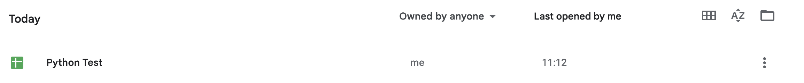

# Readme!!!

So you've checked out my awesome repo... 

Goto the [developer console](https://console.cloud.google.com/) and create a new oauth desktop app or a service account. (hint: it is under IAM)
Download the credentials - it is likely something like: `client_secret_627497838995-aab7flspv10ttd946259kmc614v2brem.apps.googleusercontent.com.json`.
Rename it as credentials.json (or adjust the code)

```
# Clone it (adjust if you download the zip or checkout with https)
git clone git@github.com:Darkflib/sheets-example.git

# change to the directory
cd sheets-example
```

Run it:

```
# create a virtual environment
python3 -m venv .venv

# enable the venv
source .venv/bin/activate

# install the pip modules
pip install -r requirements.txt

# run the actual awesome script
python main.py
```

You now should see a new document in your google docs called python test:



If didn't work? 🤔

What do the errors say? 

* This is the first time you are using the sheets api - add it by clicking the link
* can not find credentials.json - rename your downloaded credentials to credentials.json
* unauthorised - authorise yourself.
* something else? - ask chatgpt, this is free software and I am not guarenteeing it is going to work for everyone.
